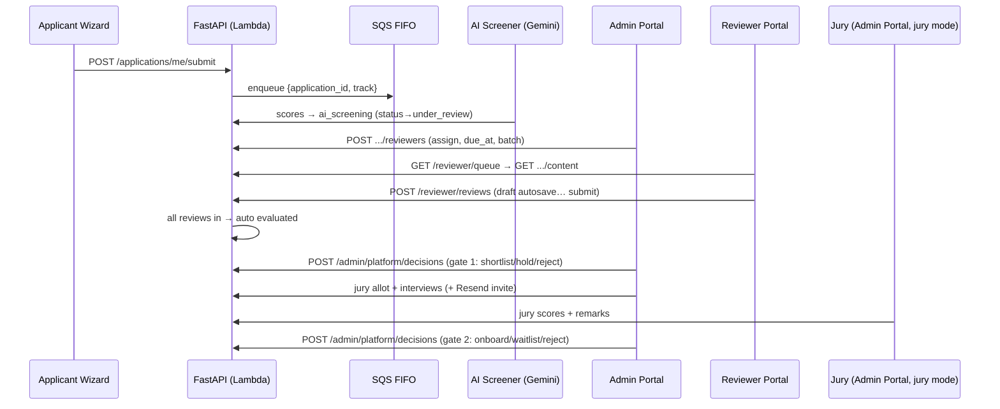

# Reviewer UI + Admin UI → Production Integration Spec

**Date:** 2026-06-12
**Scope:** Index of the `ADMIN-UI` and `REVIEWER-UI` prototype branches, the production
platform (`release/sip-launch-v1`), the production Supabase schema (migrations 001–021),
and the AWS deployment — culminating in the backend API contract needed to ship both
new UIs to production.

---

## 1. Executive summary

| | |
|---|---|
| **Production branch** | `release/sip-launch-v1` (NOT `origin/main` — main is ~288 commits behind) |
| **Prod frontend** | Vercel → `apply.artpark.info` (Vite SPA + static marketing pages) |
| **Prod backend** | AWS Lambda (FastAPI/Mangum) → `api.artpark.info`, stack `artpark-eir-api-production`, ap-south-1 |
| **Prod Supabase** | `xtmszlpwgbyoumalgbhs.supabase.co` — ONE project serves applicants + leadership + reviewers (staging: `exqmxvdtcsvpgtftwjml`) |
| **Migrations applied** | 001–021 (22 numbered files incl. 016/019 variants) |
| **AI scoring** | SQS FIFO → `artpark-eir-ai-screener-production` Lambda → Gemini 2.5 Flash via OpenRouter → `ai_screening` table |

**The single most important finding:** the production backend **already contains a
working reviewer module** — `reviewer_assignments` + `reviews` tables (migrations
014 + 016), a full `/reviewer/*` router (inbox, app detail, draft/submit/patch review,
60-min edit lock, decline), capability-based RBAC (`user_roles` + `rbac.py`), and a
basic reviewer UI in the prod SPA (`/reviewer/inbox`, `/reviewer/:track/:id/score`).

So shipping the **Reviewer Portal prototype** is mostly a *mapping + extension*
exercise (~6 new/changed endpoints, 1 small migration), while the **Admin Portal
prototype** is a genuine build: it models batches, jury, two decision gates,
interview scheduling, archive/hide, and audit views that have **no backend or schema
today** (~25 new endpoints, 3–4 new migrations).

---

## 2. The four UIs and how they interconnect

```mermaid
flowchart LR
    subgraph Applicants
        AW[Applicant Wizard\nTIR + SIP\n(LIVE in prod)]
    end
    subgraph Evaluation
        RV[Reviewer Portal\nREVIEWER-UI prototype\n(to ship)]
        AD[Admin Portal\nADMIN-UI prototype\n(to ship)]
    end
    subgraph Oversight
        LD[Leadership Dashboard\n(LIVE in prod)]
    end

    AW -- "submit → status=submitted\n→ SQS → AI screening" --> AI[(ai_screening)]
    AD -- "assign reviewers / batches\n(Gate 0)" --> RV
    AI -- "AI scores shown\n(post-submit, anti-anchoring)" --> RV
    RV -- "reviews: 5 scores + reco\n→ auto-transition under_review→evaluated" --> AD
    AD -- "Gate 1 decision: shortlist/hold/reject\nGate 2: jury + interview → onboard" --> AW
    AI --> LD
    RV --> LD
    AD -- "status changes + audit" --> LD
    LD -- "read-only oversight +\nreviewer unassign" --> AD
```

**Shared substrate (one Supabase project, one FastAPI Lambda):**
- `tir_applications` / `sip_applications` — what reviewers read and admins gate.
- `ai_screening` — one row per app (UNIQUE app_id+track); dimensions
  `score_problem, score_completeness, score_tech, score_founders, score_commitment, score_overall, confidence`.
- `reviews` + `reviewer_assignments` — reviewer output; auto-transition
  `under_review → evaluated` when all assigned reviewers submit.
- `user_roles` (applicant | founder | reviewer | mentor | leadership | admin) +
  capability map in `backend/app/rbac.py` — applicant auto-assigned on signup (mig 019).
- `application_status_log` + `audit_log_v2` — audit trail (write-only today, no read API).

**Status lifecycle (migration 015, `state_machine.py`):**

```
draft → submitted → ai_screening → under_review → evaluated → shortlisted → interview → offered → onboarded
                         ↘ screening_failed          ↘ rejected | waitlisted        (any non-terminal → withdrawn)
```

Auto-transitions today: `submitted→ai_screening→under_review` (worker),
`under_review→evaluated` (last reviewer submits). Everything from `evaluated` onward
is **manual** and currently has **no write endpoint** (leadership PATCH /status was
removed in Phase 1) — this is exactly what the Admin Portal's Gate 1/Gate 2 supply.

---

## 3. What each prototype expects vs. what production has

### 3.1 Reviewer Portal (`REVIEWER-UI` branch)

The prototype is wired through a single seam (`os/api.js` → `window.ReviewerAPI`),
with the contract documented in `REVIEWER_BACKEND_HANDOFF.md`. Mapping each seam
method to production:

| Prototype seam | Expected shape | Production today | Verdict |
|---|---|---|---|
| `getMe()` | id, name, email, initials, domains, cohort | `GET /auth/me` (no domains/cohort) | **Exists** — derive initials client-side; add `domains`/cohort later |
| `getQueue()` | QueueItem[]: app id, name, founders, industry, stage, track, due, `ai{…}`, reviewStatus | `GET /reviewer/assignments` (assignment + thin app + my_review) | **Partial** — see gaps R-1, R-2, R-3 |
| `getEvalScreen(idx)` | `{application (sections/fields/bullets/aiSummary), evaluation}` | `GET /reviewer/applications/{track}/{id}` (raw row) + `GET /reviewer/reviews/mine` | **Partial** — needs presenter shape (gap R-4) |
| `saveEvaluation()` (autosave draft) | scores{5}, recommendation, notes, disagreements, flags | `POST /reviewer/reviews` (draft=true) / `PATCH /reviewer/reviews/{id}` | **Exists** — field mapping below; flags column missing (gap R-5) |
| `submitEvaluation()` | locks after edit window | POST/PATCH with draft=false → `locked_at = now()+60min`, 423 after | **Exists** — `editWindowExpiresAt` = `locked_at` |
| `getHistory()` | stats + rows (myScore, aiScore, variance, reco, adminDecision) | `GET /reviewer/reviews?mine=true&locked=true` (no stats, no admin decision) | **Partial** — gap R-6 |
| Rubric (`GET /api/rubric`) | rubric v3.1, weights 22/30/22/14/12 | nothing (hardcoded in both prod UI & prototype) | **New** (small) — gap R-7 |

**Field mapping (prototype → `reviews` table):**

| Prototype | Column | Note |
|---|---|---|
| `scores.problem/solution/tech/founders/commit` | `score_problem / score_solution / score_tech / score_founders / score_commitment` | numeric(4,1), 0–10. ⚠️ `reviews` kept `score_solution`; only `ai_screening` was renamed to `score_completeness` (mig 016). Don't "fix" this — the 2026-05-28 prod incident was exactly this column mismatch. |
| `recommendation` yes/maybe/no | `recommendation` | identical CHECK |
| `notes` | `quick_notes` (private) — prototype "Notes" is reviewer rationale; map to `strengths`/`concerns` or `quick_notes` (decide; suggest `quick_notes`) | |
| `disagreements {dim: reason}` | `disagree_with_ai` jsonb | column exists (mig 016), never written — wire it |
| `flags: string[]` (max 8) | **missing** | new column (migration 022) |
| `overall` | computed server-side, weighted 22/30/22/14/12 | handoff §4.4 — compute in API response, don't store |

**Reviewer gaps (the actual backend work):**

- **R-1 — AI scores in the queue conflict with anti-anchoring.** The backend
  deliberately strips `ai_screening` from reviewer responses **until that reviewer has
  submitted** (`/reviewer/applications/...`). The prototype shows AI scores in the
  queue, dashboard, and eval screen *before* scoring. **Product decision required**
  (recommend: keep anti-anchoring; show AI column only post-submit, or behind a
  per-cohort config flag). The prototype's variance/disagreement UX only makes sense
  *with* visible AI scores — if anti-anchoring stays, disagreements become a
  post-submit "compare with AI" step.
- **R-2 — Queue needs a richer summary**: project_name, founders, industry, stage,
  due date, reviewStatus. `project_name`/`industry` come from `ai_screening`
  (mig 017/018); stage derives from `solution_stage` / `sip_trl`+`sip_traction`
  (logic already exists in the leadership router — reuse it). **Due date does not
  exist** → add `reviewer_assignments.due_at timestamptz` (migration 022).
- **R-3 — reviewStatus** must come from the reviewer's own review row
  (`not-started | draft | submitted`); inbox already hydrates `my_review` — expose
  its status. Note: inbox currently *excludes* locked reviews; the queue should show
  submitted ones too (use `GET /reviewer/reviews` union, or add `include=submitted`).
- **R-4 — Per-application content presenter** (`GET /api/applications/:id` §2.3):
  a serializer mapping `tir_applications`/`sip_applications` columns into
  `{aiSummary, sections[], fields[], attachments[]}` with **one-sentence bullets**
  (`bullets: string[]` preferred; UI auto-splits paragraphs). `aiSummary` =
  `ai_screening.summary` (subject to R-1). Attachments via the existing signed-URL
  allow-list machinery (port from leadership router). The prod SPA's `ApplicationTab`
  components already render raw rows — for the prototype's look, do the section/field
  shaping server-side so any future question survives without UI edits.
- **R-5 — `reviews.flags jsonb default '[]'`** (max 8, ≤80 chars each) — migration 022.
- **R-6 — History endpoint** `GET /reviewer/history`: submitted reviews joined with
  `ai_screening.score_overall` (variance computed server-side) and the application's
  current status mapped to `adminDecision` (`approved` = shortlisted/interview/offered/onboarded,
  `rejected` = rejected, `pending` = otherwise). Stats block (total, consistency %, avg
  variance, avg minutes) — compute what's cheap (total, avg variance), stub the rest as
  null until defined.
- **R-7 — Rubric**: either keep hardcoded (fastest) or `GET /rubric?track=` serving a
  versioned JSON from a new `rubrics` table. Recommend hardcode now, table later.
- **R-8 — Re-open after lock**: prototype allows "Re-open to edit"; backend hard-locks
  at 60 min (423). Decision: honor the lock (UI hides re-open after expiry — server
  already drives this via `locked_at`) or add an admin-side unlock endpoint. Recommend:
  lock stands; admin unlock ships with the Admin Portal (`POST /admin/reviews/{id}/unlock`).

### 3.2 Admin Portal (`ADMIN-UI` branch)

The prototype (admin-1.jsx + admin-2.jsx, ~6,500 lines) reads/writes `window.OS_DATA`
directly (no api.js seam — unlike the reviewer prototype) and persists to
localStorage. It models a 7-layer pipeline: intake → AI scoring → reviewer assignment
→ **Gate 1** (admin review: approve/hold/reject with 4 workflow variants incl. cutoff
slider + batch decision room) → psychometry → jury evaluation + interviews → **Gate 2**
(final: cohort/waitlist/reject), plus reviewer/jury roster management with batches,
weights and consistency, user-roles management, audit log, settings (restore
hidden/archived/held), and dashboards.

**What production already covers:**

| Prototype area | Production today |
|---|---|
| User Roles screen | `/admin/users` router: create user + invite, list; grant/revoke role, patch, reset-password (used by prod admin SPA) |
| Dashboard KPIs / funnel / industry / status breakdown | `GET /leadership/stats`, `GET /leadership/industry-categories` — same numbers, reuse or alias |
| Applications pipeline table | `GET /leadership/applications` (filters: status/track/industry/score/search, pagination) |
| Application detail + files | `GET /leadership/applications/{id}` (+ signed-url) — returns AI screening, reviews, assignments, status history |
| Reviewer unassign | `DELETE /leadership/applications/{id}/reviewers/{uid}` (409 if review submitted) |
| AI pipeline trigger | `POST /admin/ai-screening/run` (TIR only in v1) |
| Status machine + audit writes | `state_machine.py` + `application_status_log` + `audit_log_v2` (no read API) |

**What does NOT exist (the real backend build):**

| # | Gap | Schema impact | Endpoints |
|---|---|---|---|
| A-1 | **Reviewer assignment creation** (the prototype's core loop; only DELETE exists today) | none (table ready) | `POST /admin/applications/{track}/{id}/reviewers` (bulk), `POST /admin/reviewers/rebalance` |
| A-2 | **Batches** | new `batches` table + `application_batch` (or `batch_id` on a new `application_admin_meta` table) + reviewer↔batch join | batch CRUD, rename-cascade, bulk assign |
| A-3 | **Gate 1 / Gate 2 decisions** with rationale + draft-then-push bulk flow | new `admin_decisions` table (app_id, track, gate, decision, rationale, decided_by, decided_at) — status change goes through `state_machine` + status_log | `POST /admin/decisions` (single + bulk), `GET /admin/decisions/history` |
| A-4 | **Jury** | extend `user_roles` CHECK with `'jury'` (today's CHECK rejects it!) **or** model jury as reviewers with a panel flag; new `jury_assignments` + `jury_scores` (reuse `reviewer_assignments`/`reviews` shape with a `kind` column is also viable) | jury roster CRUD, random allotment, jury scorecard read |
| A-5 | **Interview scheduling** (request, datetime, Calendly link, completed, remarks, send-invite email) | new `interviews` table (app_id, track, requested, scheduled_at, calendar_link, invite_sent_at, completed, remarks) | interview CRUD + `POST .../send-invite` (Resend) |
| A-6 | **Hide / archive / restore** | `hidden_at`, `archived_at` on an `application_admin_meta` side-table (avoid touching the applicant-RLS'd app tables) | PATCH toggles + Settings restore lists |
| A-7 | **Audit log read** | none (tables exist) | `GET /admin/audit-log` (filters: actor/action/date) + CSV/JSON export |
| A-8 | **Reviewer roster metrics** (progress X/Y, consistency, weight, last activity) | `weight numeric` on a new `reviewer_profiles` table (or user_roles metadata); consistency/variance computed | `GET /admin/reviewers` (roster w/ computed metrics), `PATCH /admin/reviewers/{id}` |
| A-9 | **Psychometry** | out of scope for v1 — prototype screen ships disabled/stubbed | — |
| A-10 | **CSV exports** (pipeline, audit) | none | `GET /admin/applications/export.csv` etc. |

**Status-label mapping (prototype chips → DB statuses)** — must be canonicalized in
one shared module:

| Prototype chip | DB status |
|---|---|
| NEW | submitted |
| PROCESSING | ai_screening |
| IN REVIEW | under_review |
| EVALUATED | evaluated |
| SHORTLISTED | shortlisted |
| JURY REVIEW | interview *(or new status — decision needed; recommend reusing `interview`)* |
| ACCEPTED | onboarded (offered as intermediate) |
| REJECTED / WAITLISTED / WITHDRAWN | rejected / waitlisted / withdrawn |
| HOLD | **no equivalent** — recommend mapping to `waitlisted` at Gate 1, or add `on_hold` to the status CHECK (migration) |

---

## 4. Proposed backend build (migrations + API spec)

### 4.1 Migrations (continue prod sequence at 022)

1. **022_reviewer_ui_v2.sql** — `reviews.flags jsonb NOT NULL DEFAULT '[]'` (CHECK ≤8);
   `reviewer_assignments.due_at timestamptz`; (optional) `rubrics` table.
2. **023_admin_platform_phase2.sql** — `batches`; `application_admin_meta`
   (application_id, application_track UNIQUE pair, batch_id FK, hidden_at, archived_at,
   hold_reason); `admin_decisions`; `interviews`; `reviewer_profiles`
   (user_id PK, domains text[], weight numeric DEFAULT 1.0).
3. **024_jury.sql** — extend `user_roles_role_check` to include `'jury'`;
   `jury_assignments` + `jury_scores` (5 dims + reco + remarks), or generalize
   `reviewer_assignments`/`reviews` with `kind ('reviewer'|'jury')` — pick ONE
   (recommend separate tables; keeps the shipped reviewer flow untouched).
4. *(only if chosen in §3.2)* add `'on_hold'` to both status CHECKs + state_machine.

All service-role-only (RLS enabled, no client policies) — same pattern as migration 014.
Apply to **staging Supabase first** (`exqmxvdtcsvpgtftwjml`), smoke, then prod.
Remember: `auth.users` triggers silently no-op from Studio — none needed here, but
keep all triggers on `public.*` tables.

### 4.2 New/changed FastAPI surface

**Reviewer router (extend existing `/reviewer`):**

```
GET  /reviewer/queue              rich queue (assignment + app summary + my review status
                                  + due_at + AI block per anti-anchoring policy)
GET  /reviewer/applications/{track}/{id}/content
                                  presenter shape: {aiSummary, sections[], fields[], attachments[]}
GET  /reviewer/history            submitted reviews + ai_score + variance + admin decision + stats
GET  /rubric?track=tir|sip        rubric JSON (or keep client-side constant)
(existing POST /reviews, PATCH /reviews/{id} gain: flags, disagree_with_ai, quick_notes
 in body; response gains server-computed weighted overall + locked_at)
```

**New admin router (`/admin/platform`, capability-gated — NOT the X-Admin-Key ops router):**

```
Applications & pipeline
GET    /admin/platform/applications                 (alias of leadership list + admin_meta fields)
PATCH  /admin/platform/applications/{track}/{id}/meta     (batch, hidden, archived)
POST   /admin/platform/applications/bulk            (bulk status/batch/hide/archive)
GET    /admin/platform/applications/export.csv

Assignments & roster
POST   /admin/platform/applications/{track}/{id}/reviewers   (bulk assign, due_at)
POST   /admin/platform/reviewers/rebalance
GET    /admin/platform/reviewers                    (roster + progress/consistency/weight/last-activity)
PATCH  /admin/platform/reviewers/{user_id}          (weight, domains, batches)
POST   /admin/platform/reviews/{id}/unlock          (admin unlock of 60-min lock)

Decisions (gates)
POST   /admin/platform/decisions                    ({items:[{app,track,decision,rationale}], gate:1|2})
GET    /admin/platform/decisions/history?gate=

Jury & interviews
POST   /admin/platform/jury / GET … / PATCH …       (roster; role='jury')
POST   /admin/platform/jury/allot                   (random allotment, 2 jurors/app)
POST/PATCH /admin/platform/interviews/{track}/{id}  (schedule, link, completed, remarks)
POST   /admin/platform/interviews/{track}/{id}/send-invite   (Resend email)

Oversight
GET    /admin/platform/audit-log?actor=&action=&from=&to=    (+ /export)
GET    /admin/platform/stats                        (reuse /leadership/stats + gate metrics)
```

Every mutating endpoint: `require_capability(...)` (extend the rbac map with
`assign_reviewers`, `decide_gate`, `manage_jury`, `manage_batches`), write
`audit_log_v2`, route status changes through `state_machine.assert_legal_transition`,
log to `application_status_log`.

### 4.3 End-to-end flow after the build



---

## 5. Frontend integration strategy

Both prototypes are CDN-React + in-browser Babel with no build, auth, or routing
(by design — see handoff §1). **Fold them into the existing Vite SPA** rather than
deploying separately:

- Session/auth/refresh (`session.js`, `api.js` single-flight 401 refresh), RBAC
  gates (`rbac.js`, `landing.js`), and the design tokens
  (`colors_and_type.css`, `admin.css` §5 primitives) already exist and are shared by
  the live admin/leadership/reviewer pages.
- Reviewer Portal: replace `os/api.js` mock bodies with `reviewerApi.js` calls —
  the seam was built for exactly this; components stay untouched. Mount at
  `/reviewer/*` (replacing the current basic inbox/scoring pages).
- Admin Portal: needs an api.js-style seam first (it mutates `window.OS_DATA`
  directly) — port screens into `/src/pages/admin-platform/` behind
  `hasCapability('manage_users' | 'decide_gate' …)`, mount at `/admin/*` alongside the
  existing user-management pages.
- Same-origin deploy means **no CORS/template changes** (the SAM `!Split` CORS bug
  makes adding origins risky — hardcoded list, prod allows only `https://apply.artpark.info`).
  If a separate `admin.artpark.info` is ever wanted, the template's hardcoded
  AllowOrigins must be extended carefully.

---

## 6. AWS deployment notes (verified against live stacks)

- Stacks: `artpark-eir-api-production` (UPDATE_COMPLETE, 2026-05-29) and
  `artpark-eir-api-staging` (2026-06-07), both ap-south-1, account 348287123004.
  Both templates include the AI screener function/queue/DLQ **and** the CORS fix —
  the 2026-05-25 resource-deletion incident can't recur from this branch.
- API Lambda: python3.11/arm64, 1024 MB, 29 s (API GW hard cap); screener: 60 s,
  reserved concurrency 10. Alarms: errors/throttles/p99 + DLQ-not-empty → SNS
  `artpark-prod-alarms`.
- Deploys: `infra/sam/deploy-prod.sh` sources `backend/.env.prod`;
  **always build from a dedicated worktree** (sam build reads `backend/` from disk —
  HEAD-flip mid-build shipped wrong-branch code on 2026-05-22).
- New endpoints ride the existing ApiFunction — no new infra resources needed for
  Phase A/B below. (Optional later: SQS for bulk-decision email fan-out.)

---

## 7. Open product decisions (blockers to resolve before backend work)

1. **AI-score visibility for reviewers** (R-1) — anti-anchoring strip vs. prototype's
   AI-forward queue. Affects queue/content/history payloads.
2. **Jury data model** (A-4) — separate jury tables vs. generalized reviews with `kind`.
3. **HOLD status** — map to `waitlisted` vs. new `on_hold` status (+ state machine).
4. **JURY REVIEW status** — reuse `interview` vs. new status value.
5. **Reviewer notes mapping** — `quick_notes` (private) vs. `strengths`/`concerns`
   (leadership-visible). Prototype has a single mandatory Notes box.
6. **Re-open semantics** (R-8) — hard 60-min lock + admin unlock (recommended) vs.
   longer window.
7. **SIP AI scoring** — screener is TIR-only; Admin/Reviewer UIs are cross-track.
   Enable SIP scoring (open fast-follow from the leadership cutover) before or with
   this ship.

---

## 8. Suggested ship sequence

| Phase | Content | Where |
|---|---|---|
| **A** | Migration 022 + reviewer endpoint extensions (queue/content/history/flags/disagreements) | staging Supabase + staging stack |
| **B** | Reviewer Portal folded into SPA on a feature branch off `release/sip-launch-v1`; wire seam; QA on staging URL | Vercel staging |
| **C** | Migrations 023–024 + `/admin/platform` router (assignments → decisions → batches → audit read first; jury/interviews second) | staging |
| **D** | Admin Portal seam + fold-in; QA both portals end-to-end (applicant→AI→assign→review→gate1→jury→gate2) | staging |
| **E** | Prod cutover: apply 022–024 to prod Supabase → deploy Lambda from worktree → merge to `release/sip-launch-v1` → Vercel prod; seed reviewer/jury users via `/admin/users` | prod |

Phases A+B are independent of C+D — the Reviewer Portal can ship to production first
(its backend is 80 % there), with the Admin Portal following.

---

*Source reports: prototype indexes (ADMIN-UI, REVIEWER-UI), backend/endpoint inventory,
migration catalog 001–021, SAM/AWS verification, and prod frontend architecture — all
generated 2026-06-12 from worktrees `.claude/worktrees/{ADMIN-UI,REVIEWER-UI,release-sip-launch-v1}`.*
